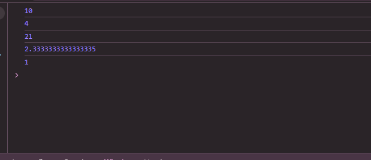

# Js_Exercise_01

***

## Developer Name : Eng Abdirahman Ai

***

## Group A

***
[github Link](https://github.com/engai2025/Js_Exercise_01)

***

## Code

~~~ Javascript

const x = 7;
const y = 3;
console.log(x+y);
console.log(x-y);
console.log(x*y);
console.log(x/y);
console.log(x%y);

~~~

 

## Output

***

***

 

## Programming language used

***

|Programming Language |Framworke | Database
|:-------------------|:----------|:--------
|Html                |0          |0
|JavaScript          |0          |0

***

## Task

- [x] Done
