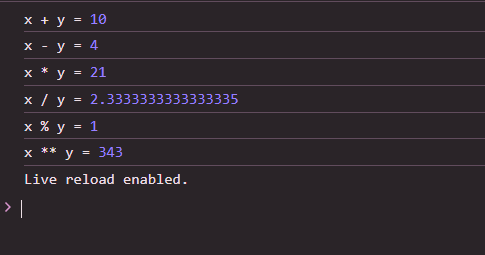

 # Js_Exercise_01
 
 ***
 
 ## Developer Name : Eng Abdirahman Ai
 
 ***
 
 ## Group A
 
 ***
 [github Link](https://github.com/engai2025/All-js)
 
 ***
 
 ## Code
 
 ~~~ Javascript
 

// Exercise 1: 
let x = 7;
let y = 3;

console.log("x + y =", x + y);     // 10 (Addition)
console.log("x - y =", x - y);     // 4  (Subtraction)
console.log("x * y =", x * y);     // 21 (Multiplication)
console.log("x / y =", x / y);     // 2.333... (Division)
console.log("x % y =", x % y);     // 1  (Modulus - remainder)
console.log("x ** y =", x ** y);   // 343 (Exponentiation: 7^3)

 
 
 ~~~
 
 
  
 
 ## Output
 
 ***
 
 ***
 
  
 
 ## Programming language used
 
 ***
 
 |Programming Language |Framworke | Database
 |:-------------------|:----------|:--------
 |Html                |0          |0
 |JavaScript          |0          |0
 
 ***
 
 ## Task
 
 - [x] Done
 