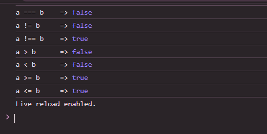

# Js_Exercise_02

***

## Developer Name : Eng Abdirahman Ai

***

## Group A

***
[github Link](https://github.com/engai2025/Js_Exercise_01)

***

## Code

~~~ Javascript

 let a = 15;
let b = "15";

console.log("a == b     =>", a == b);     // true
console.log("a === b    =>", a === b);    // false
console.log("a != b     =>", a != b);     // false
console.log("a !== b    =>", a !== b);    // true
console.log("a > b      =>", a > b);      // false
console.log("a < b      =>", a < b);      // false
console.log("a >= b     =>", a >= b);     // true
console.log("a <= b     =>", a <= b);     // true

~~~

 

## Output

***

***

 

## Programming language used

***

|Programming Language |Framworke | Database
|:-------------------|:----------|:--------
|Html                |0          |0
|JavaScript          |0          |0

***

## Task

- [x] Done
