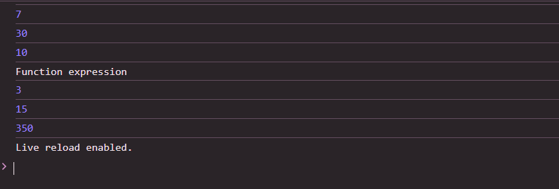

 # Js_Exercise_04
 
 ***
 
 ## Developer Name : Eng Abdirahman Ai
 
 ***
 
 ## Group A
 
 ***
 [github Link](https://github.com/engai2025/All-js)
 
 ***
 
 ## Code
 
 ~~~ Javascript
 

// Exercise 4: 
// Function declaration
console.log("Function declaration")
function add(x, y) {
  return x + y;
}

// Tijaabi adigoo wacaya:
console.log(add(3, 4));       // 7
console.log(add(10, 20));     // 30
console.log(add(-5, 15));     // 10

console.log("Function expression")
// Function expression
const adds = function(x, y) {
  return x + y;
};

// Tijaabi adigoo wacaya:
console.log(adds(1, 2));       // 3
console.log(adds(7, 8));       // 15
console.log(adds(100, 250));   // 350

 
 
 ~~~
 
 
  
 
 ## Output
 
 ***
 
 ***
 
  
 
 ## Programming language used
 
 ***
 
 |Programming Language |Framworke | Database
 |:-------------------|:----------|:--------
 |Html                |0          |0
 |JavaScript          |0          |0
 
 ***
 
 ## Task
 
 - [x] Done
 