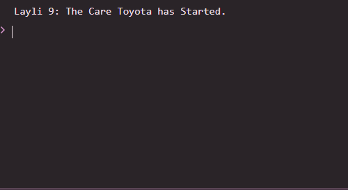

 # Js_Exercise_09
 
 ***
 
 ## Developer Name : Eng Abdirahman Ai
 
 ***
 
 ## Group A
 
 ***
 [github Link](https://github.com/engai2025/All-js)
 
 ***
 
 ## Code
 
 ~~~ Javascript
 

// Exercise 9: Object Methods
let cars = {
    make: "Toyota",
    modal: "Corolla",
    Year: 2025,
    start: function() {
        console.log(`Layli 9: Mishiinka gaariga ${this.make} waa shidan yahay.`);
    }
};
cars.start();

 
 
 ~~~
 
 
  
 
 ## Output
 
 ***
 
 ***
 
  
 
 ## Programming language used
 
 ***
 
 |Programming Language |Framworke | Database
 |:-------------------|:----------|:--------
 |Html                |0          |0
 |JavaScript          |0          |0
 
 ***
 
 ## Task
 
 - [x] Done
 