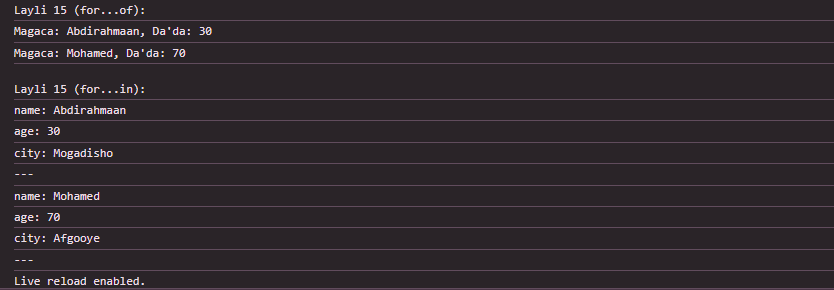

 # Js_Exercise_15
 
 ***
 
 ## Developer Name : Eng Abdirahman Ai
 
 ***
 
 ## Group A
 
 ***
 [github Link](https://github.com/engai2025/All-js)
 
 ***
 
 ## Code
 
 ~~~ Javascript
 

  // Exercise 15: For...of and For...in Loops

const people = [
    {
        name: "Abdirahmaan",
        age: 30,
        city: "Mogadisho"
    },
    {
        name: "Mohamed",
        age: 70,
        city: "Afgooye"
    }
];

console.log("Layli 15 (for...of):");
for (const person of people) {
    console.log(`Magaca: ${person.name}, Da'da: ${person.age}`);
}

console.log("\nLayli 15 (for...in):");
for (const person of people) {
    for (const key in person) {
        console.log(`${key}: ${person[key]}`);
    }
    console.log('---');
}

 
 
 ~~~
 
 
  
 
 ## Output
 
 ***
 
 
 ***
 
  
 
 ## Programming language used
 
 ***
 
 |Programming Language |Framworke | Database
 |:-------------------|:----------|:--------
 |Html                |0          |0
 |JavaScript          |0          |0
 
 ***
 
 ## Task
 
 - [x] Done
 