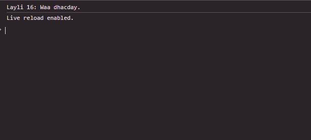

 # Js_Exercise_16
 
 ***
 
 ## Developer Name : Eng Abdirahman Ai
 
 ***
 
 ## Group A
 
 ***
 [github Link](https://github.com/engai2025/All-js)
 
 ***
 
 ## Code
 
 ~~~ Javascript
 

// Exercise 16: If/Else Statement
let Score = 49;
if (Score >= 50) {
    console.log("Layli 16: Waa guuleysatay.");
} else {
    console.log("Layli 16: Waa dhacday.");
}

 
 
 ~~~
 
 
  
 
 ## Output
 
 ***
 
 
 ***
 
  
 
 ## Programming language used
 
 ***
 
 |Programming Language |Framworke | Database
 |:-------------------|:----------|:--------
 |Html                |0          |0
 |JavaScript          |0          |0
 
 ***
 
 ## Task
 
 - [x] Done
 