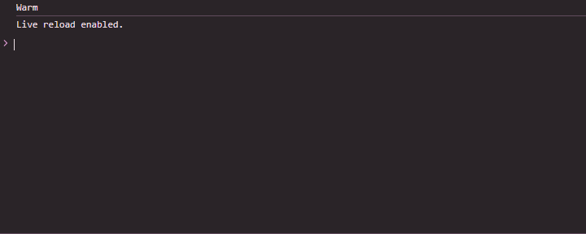

 # Js_Exercise_17
 
 ***
 
 ## Developer Name : Eng Abdirahman Ai
 
 ***
 
 ## Group A
 
 ***
 [github Link](https://github.com/engai2025/All-js)
 
 ***
 
 ## Code
 
 ~~~ Javascript
 

// Exercise 17:
let temperature = 18; // Isbedel si aad u tijaabiso heerkul kala duwan

if (temperature < 0) {
    console.log("Very cold");
} else if (temperature >= 0 && temperature < 15) {
    console.log("Cold");
} else if (temperature >= 15 && temperature <= 25) {
    console.log("Warm");
} else {
    console.log("Hot");
}

 
 
 ~~~
 
 
  
 
 ## Output
 
 ***
 
 
 ***
 
  
 
 ## Programming language used
 
 ***
 
 |Programming Language |Framworke | Database
 |:-------------------|:----------|:--------
 |Html                |0          |0
 |JavaScript          |0          |0
 
 ***
 
 ## Task
 
 - [x] Done
 