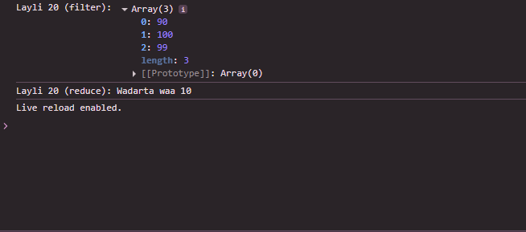

 # Js_Exercise_20
 
 ***
 
 ## Developer Name : Eng Abdirahman Ai
 
 ***
 
 ## Group A
 
 ***
 [github Link](https://github.com/engai2025/All-js)
 
 ***
 
 ## Code
 
 ~~~ Javascript
 

// Exercise 20: map, filter, reduce Methods
const scores = [70, 80, 90, 100, 99];
const newScores = scores.filter((score) => score >= 90);
console.log("Layli 20 (filter):", newScores);

const numberArray = [1, 2, 3, 4];
const sum = numberArray.reduce((total, num) => total + num, 0);
console.log("Layli 20 (reduce): Wadarta waa " + sum);
 
 
 ~~~
 
 
  
 
 ## Output
 
 ***
 
 
 ***
 
  
 
 ## Programming language used
 
 ***
 
 |Programming Language |Framworke | Database
 |:-------------------|:----------|:--------
 |Html                |0          |0
 |JavaScript          |0          |0
 
 ***
 
 ## Task
 
 - [x] Done
 