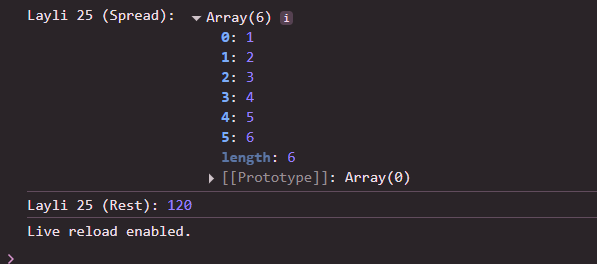

 # Js_Exercise_25
 
 ***
 
 ## Developer Name : Eng Abdirahman Ai
 
 ***
 
 ## Group A
 
 ***
 [github Link](https://github.com/engai2025/All-js)
 
 ***
 
 ## Code
 
 ~~~ Javascript
 

// Exercise 25: Spread & Rest Operators
const number1 = [1, 2, 3];
const all = [...number1, 4, 5, 6];
console.log("Layli 25 (Spread):", all);

function multiply(...nums) {
    return nums.reduce((total, num) => total * num, 1);
}
console.log("Layli 25 (Rest):", multiply(10, 2, 3, 2));
 
 
 ~~~
 
 
  
 
 ## Output
 
 ***
 
 
 ***
 
  
 
 ## Programming language used
 
 ***
 
 |Programming Language |Framworke | Database
 |:-------------------|:----------|:--------
 |Html                |0          |0
 |JavaScript          |0          |0
 
 ***
 
 ## Task
 
 - [x] Done
 