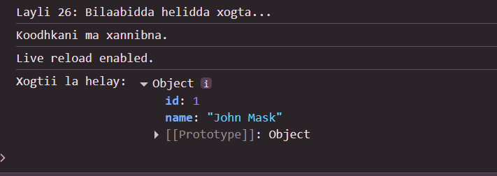

 # Js_Exercise_26
 
 ***
 
 ## Developer Name : Eng Abdirahman Ai
 
 ***
 
 ## Group A
 
 ***
 [github Link](https://github.com/engai2025/All-js)
 
 ***
 
 ## Code
 
 ~~~ Javascript
 

 
// Exercise 26: Asynchronous JavaScript (Callback)
function getUserData(callback) {
    setTimeout(() => {
        const user = { id: 1, name: "John Mask" };
        callback(user);
    }, 1000);
}
console.log("Layli 26: Bilaabidda helidda xogta...");
getUserData(function(user) {
    console.log("Xogtii la helay:", user);
});
console.log("Koodhkani ma xannibna.");
 
 
 ~~~
 
 
  
 
 ## Output
 
 ***
 
 
 ***
 
  
 
 ## Programming language used
 
 ***
 
 |Programming Language |Framworke | Database
 |:-------------------|:----------|:--------
 |Html                |0          |0
 |JavaScript          |0          |0
 
 ***
 
 ## Task
 
 - [x] Done
 