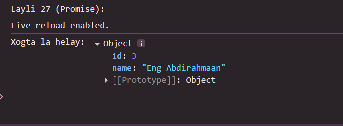

 # Js_Exercise_27
 
 ***
 
 ## Developer Name : Eng Abdirahman Ai
 
 ***
 
 ## Group A
 
 ***
 [github Link](https://github.com/engai2025/All-js)
 
 ***
 
 ## Code
 
 ~~~ Javascript
 

 
 // Exercise 27: Promises
function fetchDataWithPromise() {
    return new Promise((resolve, reject) => {
        setTimeout(() => {
            const success = true;
            if (success) {
                resolve({ id: 3, name: "Eng Abdirahmaan" });
            } else {
                reject("Cilad baa dhacday markii xogta la raadinayay.");
            }
        }, 1500);
    });
}
console.log("Layli 27 (Promise):");
fetchDataWithPromise()
    .then((data) => { console.log("Xogta la helay:", data); })
    .catch(error => console.log("Cilad:", error));
 
 
 ~~~
 
 
  
 
 ## Output
 
 ***
 
 
 ***
 
  
 
 ## Programming language used
 
 ***
 
 |Programming Language |Framworke | Database
 |:-------------------|:----------|:--------
 |Html                |0          |0
 |JavaScript          |0          |0
 
 ***
 
 ## Task
 
 - [x] Done
 