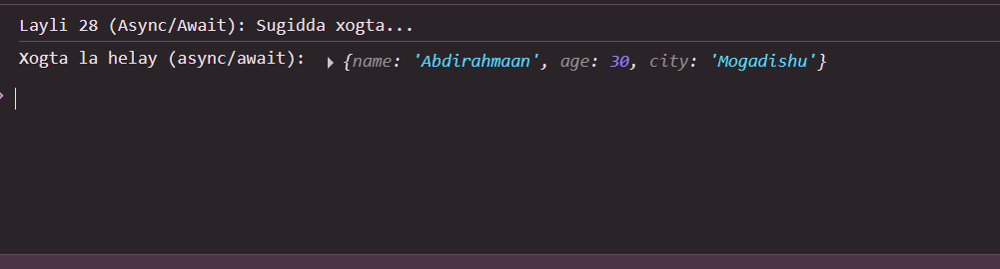

 # Js_Exercise_28
 
 ***
 
 ## Developer Name : Eng Abdirahman Ai
 
 ***
 
 ## Group A
 
 ***
 [github Link](https://github.com/engai2025/All-js)
 
 ***
 
 ## Code
 
 ~~~ Javascript
 

 // Exercise 28: Async/Await
 
 // Simulate fetching data with a Promise
function fetchDataWithPromise() {
    return new Promise((resolve, reject) => {
        setTimeout(() => {
            const user = {
                name: "Abdirahmaan",
                age: 30,
                city: "Mogadishu"
            };
            resolve(user); // Haddii aad rabto cilad, isticmaal reject("Cilad");
        }, 2000); // 2 ilbiriqsi kadib
    });
}

// Exercise 28: Async/Await
async function displayUserData() {
    try {
        console.log("Layli 28 (Async/Await): Sugidda xogta...");
        const user = await fetchDataWithPromise();
        console.log("Xogta la helay (async/await):", user);
    } catch (err) {
        console.log("Cilad ayaa dhacday:", err);
    }
}

displayUserData();

 ~~~
 
 
  
 
 ## Output
 
 ***
 
 
 ***
 
  
 
 ## Programming language used
 
 ***
 
 |Programming Language |Framworke | Database
 |:-------------------|:----------|:--------
 |Html                |0          |0
 |JavaScript          |0          |0
 
 ***
 
 ## Task
 
 - [x] Done
 