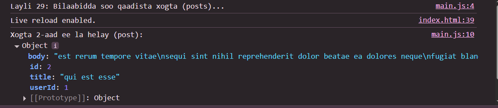

 # Js_Exercise_29
 
 ***
 
 ## Developer Name : Eng Abdirahman Ai
 
 ***
 
 ## Group A
 
 ***
 [github Link](https://github.com/engai2025/All-js)
 
 ***
 
 ## Code
 
 ~~~ Javascript
 

 // Exercise 29: Fetch API
async function fetchPosts() {
    try {
        console.log("Layli 29: Bilaabidda soo qaadista xogta (posts)...");
        const response = await fetch('https://jsonplaceholder.typicode.com/posts');
        if (!response.ok) {
            throw new Error(`Cilad HTTP! heerka: ${response.status}`);
        }
        const data = await response.json();
        console.log("Xogta 2-aad ee la helay (post):", data[1]);
    } catch (error) {
        console.log(error);
    }
}
fetchPosts();
 ~~~
 
 
  
 
 ## Output
 
 ***
 
 
 ***
 
  
 
 ## Programming language used
 
 ***
 
 |Programming Language |Framworke | Database
 |:-------------------|:----------|:--------
 |Html                |0          |0
 |JavaScript          |0          |0
 
 ***
 
 ## Task
 
 - [x] Done
 