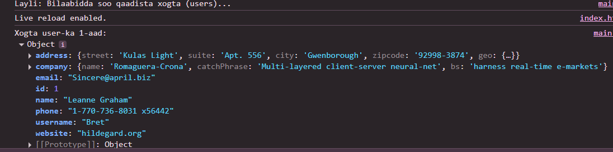
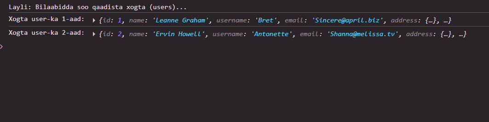

 # Js_Exercise_31
 
 ***
 
 ## Developer Name : Eng Abdirahman Ai
 
 ***
 
 ## Group A
 
 ***
 [github Link](https://github.com/engai2025/All-js)
 
 ***
 
 ## Code
 
 ~~~ Javascript
 

 // Exercise 31: USERS  info  using  async/await
 
async function fetchUsers() {
    try {
        console.log("Layli: Bilaabidda soo qaadista xogta (users)...");
        
        const response = await fetch('https://jsonplaceholder.typicode.com/users');
        
        if (!response.ok) {
            throw new Error(`Cilad HTTP! Heerka: ${response.status}`);
        }

        const data = await response.json();
        console.log("Xogta user-ka 1-aad:", data[0]); // Daabac user-ka ugu horeeya
        console.log("Xogta user-ka 2-aad:", data[1]); // Daabac user-ka labaad
        
   
   

    } catch (error) {
        console.log("Cilad ayaa dhacday:", error);
    }
}

fetchUsers(); // Function-ka wac

 ~~~
 
 
  
 
 ## Output
 
 ***
 
 
 
 ***
 
  
 
 ## Programming language used
 
 ***
 
 |Programming Language |Framworke | Database
 |:-------------------|:----------|:--------
 |Html                |0          |0
 |JavaScript          |0          |0
 
 ***
 
 ## Task
 
 - [x] Done
 