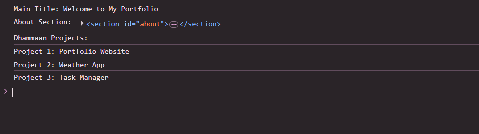

 # Js_Exercise_32
 
 ***
 
 ## Developer Name : Eng Abdirahman Ai
 
 ***
 
 ## Group A
 
 ***
 [github Link](https://github.com/engai2025/All-js)
 
 ***
 
 ## Code
 
 ~~~ Javascript
 
 // Exercise 32:  Using querySelector & querySelectorAll

 
const mainTitle = document.querySelector(".title");
console.log("Main Title:", mainTitle.textContent);

 
const aboutSection = document.querySelector("#about");
console.log("About Section:", aboutSection);

 
const projects = document.querySelectorAll(".project");
console.log("Dhammaan Projects:");
projects.forEach((project, index) => {
  console.log(`Project ${index + 1}:`, project.textContent);
});

 ~~~
 
 
  
 
 ## Output
 
 ***
 
 
 
 ***
 
  
 
 ## Programming language used
 
 ***
 
 |Programming Language |Framworke | Database
 |:-------------------|:----------|:--------
 |Html                |0          |0
 |JavaScript          |0          |0
 
 ***
 
 ## Task
 
 - [x] Done
 