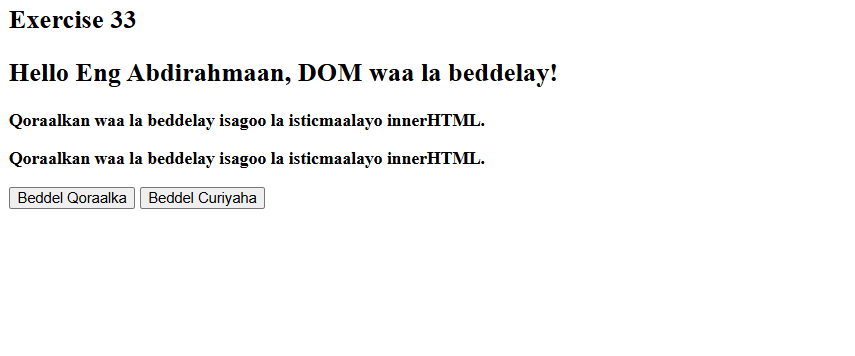

 # Js_Exercise_33
 
 ***
 
 ## Developer Name : Eng Abdirahman Ai
 
 ***
 
 ## Group A
 
 ***
 [github Link](https://github.com/engai2025/All-js)
 
 ***
 
 ## Code
 
 ~~~ Javascript
 
 // Exercise 32:  Using querySelector & querySelectorAll

 
 const header1 = document.querySelector('#header1');
const textElements = document.querySelectorAll('.text');

function changeText() {
    header1.textContent = "Hello Eng Abdirahmaan, DOM waa la beddelay!";
}

function changeElement() {
    textElements.forEach(el => {
        el.innerHTML = "<b>Qoraalkan waa la beddelay isagoo la isticmaalayo innerHTML.</b>";
    });
}

 ~~~
 
 
  
 
 ## Output
 
 ***
 
 
 
 
 ***
 
  
 
 ## Programming language used
 
 ***
 
 |Programming Language |Framworke | Database
 |:-------------------|:----------|:--------
 |Html                |0          |0
 |JavaScript          |0          |0
 
 ***
 
 ## Task
 
 - [x] Done
 