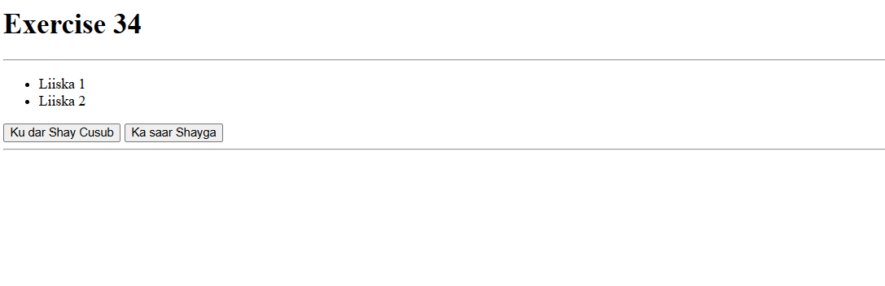
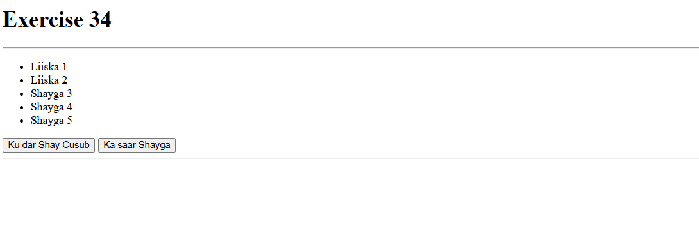
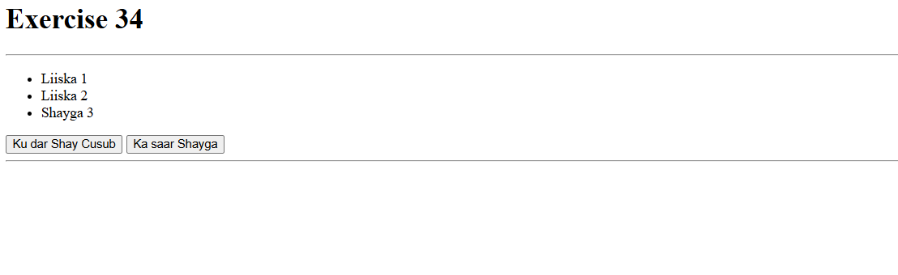

 # Js_Exercise_34
 
 ***
 
 ## Developer Name : Eng Abdirahman Ai
 
 ***
 
 ## Group A
 
 ***
 [github Link](https://github.com/engai2025/All-js)
 
 ***
 
 ## Code
 
 ~~~ Javascript
 
// Exercise 34: Adding And Removing Elements
const ul1 = document.querySelector('#ul1');
function addItem() {
    const newitem = document.createElement('li');
    newitem.textContent = `Shayga ${ul1.children.length + 1}`;
    ul1.appendChild(newitem);
}

function removeItem() {
    if (ul1.lastChild) {
        ul1.removeChild(ul1.lastChild);
    } else {
        alert('Ma jiro shay la saarayo!');
    }
}

 ~~~
 
 
  
 
 ## Output
 
 ***
 ##Defualt
 

 ##Adding Some Item
 
 ##Removing Some items
 
 
 
 
 ***
 
  
 
 ## Programming language used
 
 ***
 
 |Programming Language |Framworke | Database
 |:-------------------|:----------|:--------
 |Html                |0          |0
 |JavaScript          |0          |0
 
 ***
 
 ## Task
 
 - [x] Done
 