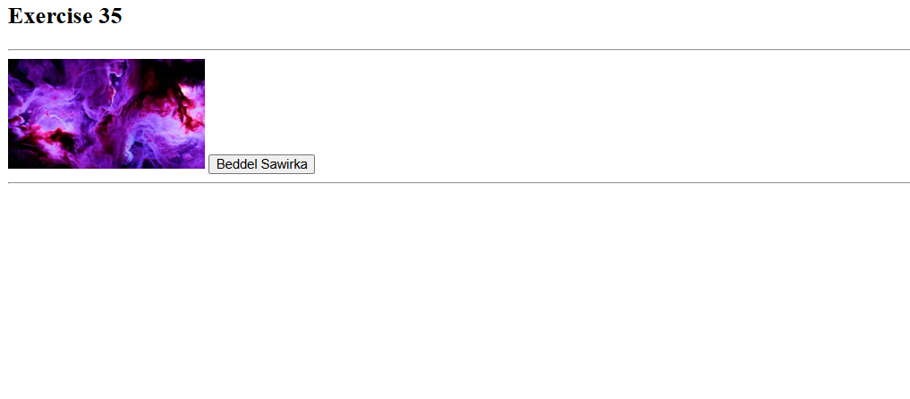
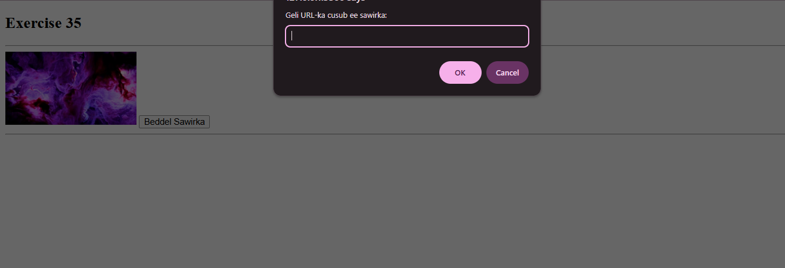
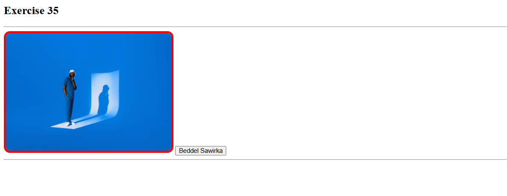

 # Js_Exercise_34
 
 ***
 
 ## Developer Name : Eng Abdirahman Ai
 
 ***
 
 ## Group A
 
 ***
 [github Link](https://github.com/engai2025/All-js)
 
 ***
 
 ## Code
 
 ~~~ Javascript
 
   <h2>Exercise 35 Html</h2>
 

 

<button onclick="changeImage()">Beddel Sawirka</button>

    

   <h2>Exercise 35 JavaScript</h2>
      //Exercise 35:Enhance Image Styling Dynamically
      
function changeImage() {
    // 1. Hel img tag
    const img = document.getElementById("image");

    // 2. Weydii user-ka xogta loo baahan yahay
    const newUrl = prompt("Geli URL-ka cusub ee sawirka:");
    const borderColor = prompt("Geli midabka border-ka (tusaale: red, blue, #00ff00):");
    const width = prompt("Geli ballaca sawirka (px):");
    const height = prompt("Geli dhererka sawirka (px):");
    const borderRadius = prompt("Geli border radius (px) si aad geesaha u wareejiso:");

   
    if (newUrl) img.src = newUrl;
    if (borderColor) img.style.border = `5px solid ${borderColor}`;
    if (width) img.style.width = `${width}px`;
    if (height) img.style.height = `${height}px`;
    if (borderRadius) img.style.borderRadius = `${borderRadius}px`;
}

 ~~~
 
 
  
 
 ## Output
 
 ***
 ## Defualt
 

 # Adding url
 
 # Changing img
 
 
 
 
 ***
 
  
 
 ## Programming language used
 
 ***
 
 |Programming Language |Framworke | Database
 |:-------------------|:----------|:--------
 |Html                |0          |0
 |JavaScript          |0          |0
 
 ***
 
 ## Task
 
 - [x] Done
 