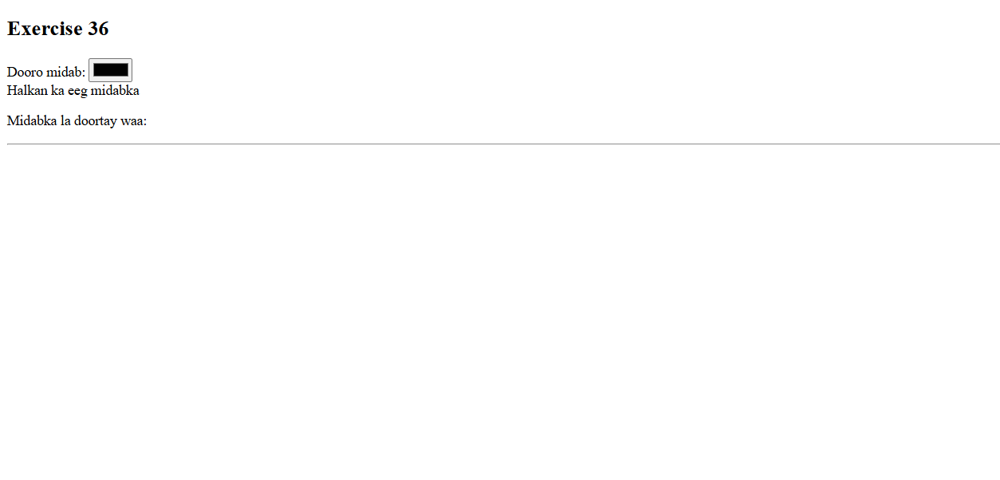
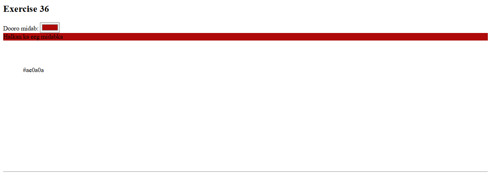

 # Js_Exercise_36
 
 ***
 
 ## Developer Name : Eng Abdirahman Ai
 
 ***
 
 ## Group A
 
 ***
 [github Link](https://github.com/engai2025/All-js)
 
 ***
 
 ## Code
 
 ~~~ Javascript
 
   <h2>Exercise 36 Html</h2>
 

<!DOCTYPE html>
<html lang="en">
<head>
    <meta charset="UTF-8">
    <meta name="viewport" content="width=device-width, initial-scale=1.0">
    <title>Exercise 36</title>
</head>
<body>
    <h2>Exercise 36</h2>
    
   <label for="colorPicker">Dooro midab:</label>
   <input type="color" id="colorPicker">
   
Halkan ka eeg midabka

   
Midabka la doortay waa: 

    

    
</body>
</html>

    

   <h2>Exercise 36 JavaScript</h2>
 
const colorPicker = document.querySelector('#colorPicker');
const color_view = document.querySelector('#color_view');
const selectedColorValue = document.querySelector('#selectedColorValue');

function changeTextStyle() {
    colorPicker.addEventListener('input', function() {
        const color = colorPicker.value;
        color_view.style.backgroundColor = color;
        selectedColorValue.textContent = color;
         selectedColorValue.style.padding="50px"
         selectedColorValue.style.width="200px"
         selectedColorValue.style.height="200px"
    });
}

changeTextStyle();

 ~~~
 
 
  
 
 ## Output
 
 ***
 ## Defualt
 

 # Adding Background-color with hexdicimal color code
 
 
 
 
 
 
 ***
 
  
 
 ## Programming language used
 
 ***
 
 |Programming Language |Framworke | Database
 |:-------------------|:----------|:--------
 |Html                |0          |0
 |JavaScript          |0          |0
 
 ***
 
 ## Task
 
 - [x] Done
 