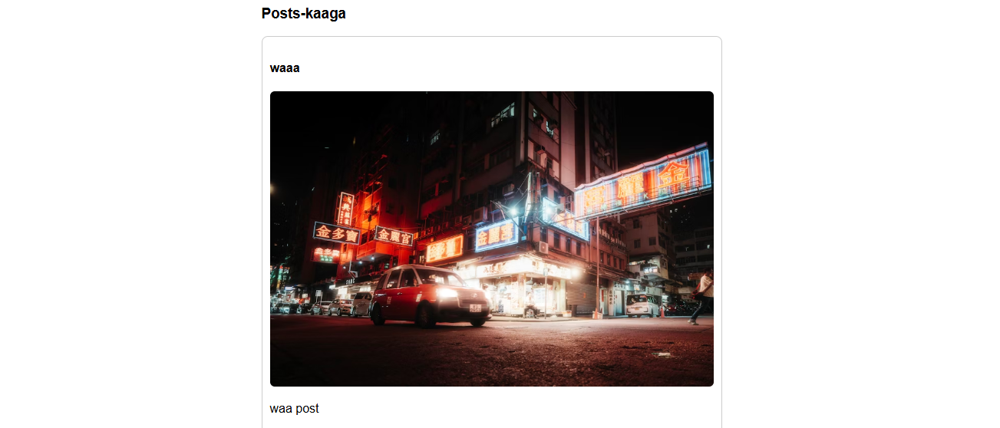

 # Js_Exercise_37
 
 ***
 
 ## Developer Name : Eng Abdirahman Ai
 
 ***
 
 ## Group A
 
 ***
 [github Link](https://github.com/engai2025/All-js)
 
 ***
 
 ## Code
 
 ~~~ Javascript
 
   <h2>Exercise 37 Html</h2>
 
<!DOCTYPE html>
<html lang="en">
<head>
  <meta charset="UTF-8">
  <title>Blog Post App</title>
  
</head>
<body>

  <h2>Samee Blog Post</h2>

  <input type="text" id="title" placeholder="Geli Cinwaanka">
  <input type="text" id="imageUrl" placeholder="Geli URL-ka Sawirka">
  <textarea id="description" placeholder="Geli Sharaxaada" rows="4"></textarea>
  <button onclick="savePost()">Kaydi Post</button>

  <h3>Posts-kaaga</h3>
  

  
  </body>
  </html>

   <h2>Exercise 37 JavaScript</h2>
 
   // Exercise 37 Post Blog
 function savePost() {
      const title = document.getElementById('title').value;
      const imageUrl = document.getElementById('imageUrl').value;
      const description = document.getElementById('description').value;

      if (!title || !imageUrl || !description) {
        alert("Fadlan buuxi dhammaan meelaha!");
        return;
      }

      const post = { title, imageUrl, description };

      let posts = JSON.parse(localStorage.getItem('blogPosts')) || [];
      posts.push(post);
      localStorage.setItem('blogPosts', JSON.stringify(posts));

      showPosts(); // Refresh
      document.getElementById('title').value = "";
      document.getElementById('imageUrl').value = "";
      document.getElementById('description').value = "";
    }

    function showPosts() {
      const posts = JSON.parse(localStorage.getItem('blogPosts')) || [];
      const container = document.getElementById('postsContainer');
      container.innerHTML = "";

      posts.forEach((post, index) => {
        container.innerHTML += `
          

            <h4>${post.title}</h4>
            
            
${post.description}

          

        `;
      });
    }

    // Marka bogga la furo
    showPosts();
 ~~~
 
 
  
 
 ## Output
 
 ***
 ## Defualt
 

 #  Result
 
 
 
 
 
 
 ***
 
  
 
 ## Programming language used
 
 ***
 
 |Programming Language |Framworke | Database
 |:-------------------|:----------|:--------
 |Html                |0          |0
 |JavaScript          |0          |0
 
 ***
 
 ## Task
 
 - [x] Done
 