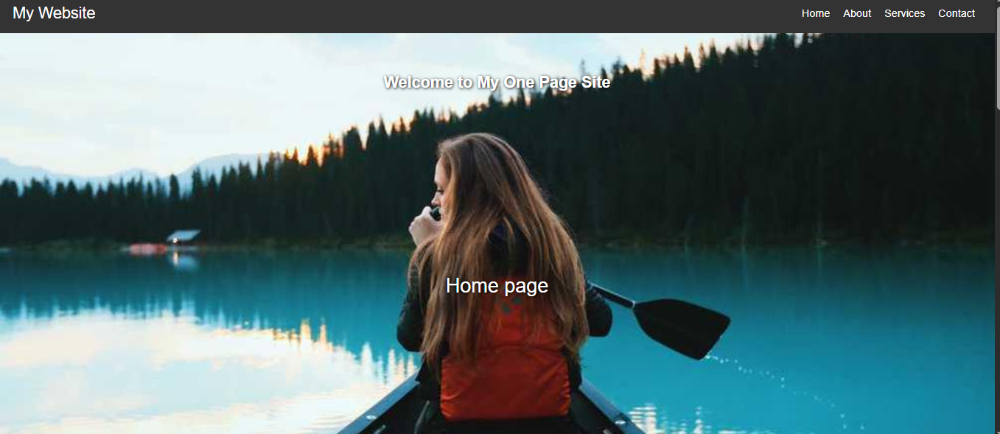
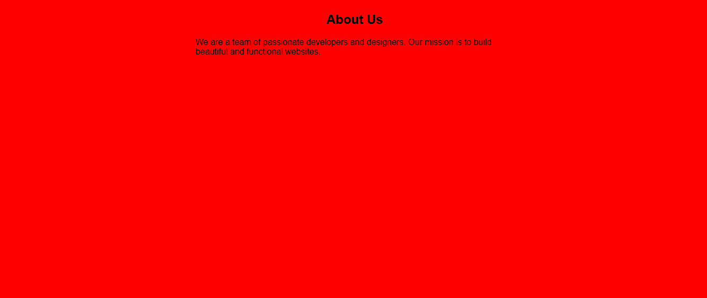
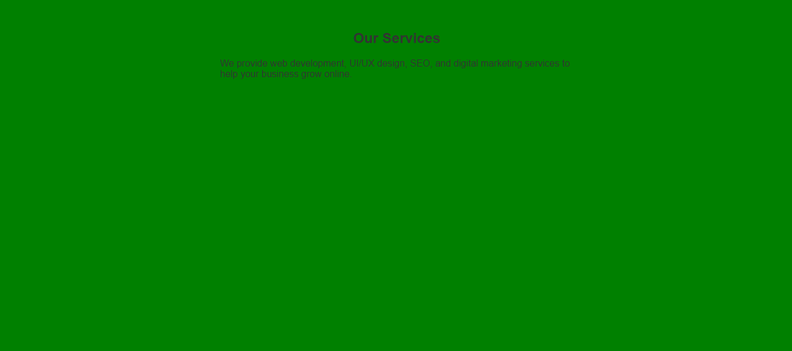
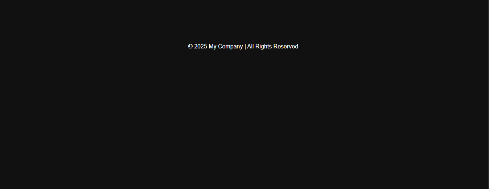

 # Js_Exercise_38
 
 ***
 
 ## Developer Name : Eng Abdirahman Ai
 
 ***
 
 ## Group A
 
 ***
 [github Link](https://github.com/engai2025/All-js)
 
 ***
 
 ## Code
 
 ~~~ Javascript
 
   <h2>Exercise 38 Html</h2>
 
 <!DOCTYPE html>
<html lang="en">
<head>
    <meta charset="UTF-8">
    <meta name="viewport" content="width=device-width, initial-scale=1.0">
    <title>Responsive Navigation Bar</title>
    <link rel="stylesheet" href="style.css">
</head>
<body>
    <!-- Navigation Bar -->
    <nav class="navbar">
        
My Website

        <a href="#" class="toggle-button">
            
            
            
        </a>
        

            <ul>
                <li><a href="#">Home</a></li>
                <li><a href="#">About</a></li>
                <li><a href="#">Services</a></li>
                <li><a href="#">Contact</a></li>
            </ul>
        

    </nav>

    
  <!-- Home Section -->
  <section id="home">
    <h1>Welcome to My One Page Site</h1>
    
Home page

  </section>

  <!-- About Section -->
  <section id="about">
    <h2>About Us</h2>
    

      We are a team of passionate developers and designers. Our mission is to build beautiful and functional websites.
    

  </section>

  <!-- Services Section -->
  <section id="services">
    <h2>Our Services</h2>
    

      We provide web development, UI/UX design, SEO, and digital marketing services to help your business grow online.
    

  </section>

  <!-- Footer -->
  <section id="footer">
    
&copy; 2025 My Company | All Rights Reserved

  </section>

    
</body>
</html>

   <h2>Exercise 38 Css</h2>

   /* General Styles */
* {
    box-sizing: border-box;
    margin: 0;
    padding: 0;
}

body {
    font-family: Arial, sans-serif;
}

/* Navbar Styling */
.navbar {
    display: flex;
    background-color: #333;
    color: white;
    justify-content: space-between;
    align-items: center;
    padding: 0 20px;
}

.brand-title {
    font-size: 1.5em;
    line-height: 60px;
}

.navbar-links {
    height: 100%;
}

.navbar-links ul {
    display: flex;
    list-style: none;
    margin: 0;
    padding: 0;
}

.navbar-links li {
    padding: 0 10px;
}

.navbar-links a {
    color: white;
    text-decoration: none;
    font-size: 1em;
    line-height: 60px;
    display: block;
}

.navbar-links a:hover {
    background-color: #444;
}

/* Toggle Button */
.toggle-button {
    position: absolute;
    top: 15px;
    right: 20px;
    display: none;
    flex-direction: column;
    justify-content: space-between;
    width: 30px;
    height: 21px;
    cursor: pointer;
}

.toggle-button .bar {
    height: 3px;
    width: 100%;
    background-color: white;
    border-radius: 10px;
    transition: 0.3s;
}

    section {
      height: 100vh;
      padding: 60px 20px 20px 20px;
    }

    #home {
      background: url('https://picsum.photos/id/1011/1000/600') no-repeat center center/cover;
      color: white;
      display: flex;
      justify-content: center;
      align-items: center;
      flex-direction: column;
      text-shadow: 1px 1px 5px black;
    }

  #services {
        background: green;

      color: #333;
    }
      #about{
        background: red;

      }
      h2{
        text-align: center;
      }
      #pp{
        color: white;
        font-size: 30px;
      }

    #footer {
      background: #111;
      color: white;
      text-align: center;
      padding: 20px;
    }

    h1, h2 {
      margin-bottom: 20px;
    }
  #footer p{
    margin-block: 100px;
  }
    p {
      max-width: 600px;
      margin: auto;
    }

/* Media Queries for Mobile Screens */
@media (max-width: 768px) {
    .navbar {
        flex-direction: column;
        align-items: flex-start;
    }

    .toggle-button {
        display: flex;
    }

    .navbar-links {
        width: 100%;
        max-height: 0;
        overflow: hidden;
        transition: max-height 0.5s ease-out, opacity 0.5s ease-out;
        opacity: 0;
    }

    .navbar-links ul {
        flex-direction: column;
        width: 100%;
    }

    .navbar-links li {
        text-align: center;
    }

    .navbar-links a {
        padding: 10px;
        line-height: 20px;
    }

    .navbar.active .navbar-links {
        max-height: 300px;
        opacity: 1;
        transition: max-height 0.5s ease-in, opacity 0.5s ease-in;
    }

    /* Change the toggle button bars for the open state */
    .navbar.active .toggle-button .bar:nth-child(2) {
        opacity: 0;
    }

    .navbar.active .toggle-button .bar:nth-child(1) {
        transform: translateY(8px) rotate(45deg);
    }

    .navbar.active .toggle-button .bar:nth-child(3) {
        transform: translateY(-8px) rotate(-45deg);
    }
}

   <h2>Exercise 38 JavaScript</h2>
 
//Exercise 38
const toggleButton = document.querySelector('.toggle-button');
const navbar = document.querySelector('.navbar');

toggleButton.addEventListener('click', function(){
    navbar.classList.toggle("active")
})
 ~~~
 
 
  
 
 ## Output
 
 ***
 ## Home
 

 #  About
 

  #  Services
 

  #  Footer
 
 
 
 
 
 
 ***
 
  
 
 ## Programming language used
 
 ***
 
 |Programming Language |Framworke | Database
 |:-------------------|:----------|:--------
 |Html                |0          |0
 |JavaScript          |0          |0
 
 ***
 
 ## Task
 
 - [x] Done
 