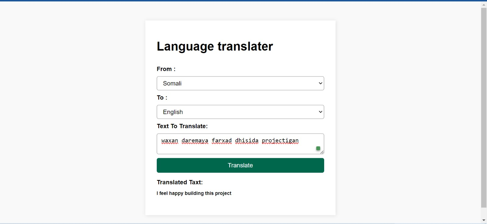

 # Js_Exercise_39
 
 ***
 
 ## Developer Name : Eng Abdirahman Ai
 
 ***
 
 ## Group A
 
 ***
 [github Link](https://github.com/engai2025/All-js)
 
 ***
 
 ## Code
 
 ~~~ Javascript
 
   <h2>Exercise 39 Html</h2>
 
   <!DOCTYPE html>
<html lang="en">
  <head>
    <meta charset="UTF-8" />
    <meta name="viewport" content="width=device-width, initial-scale=1.0" />
    <title>Language translater</title>
    <link rel="stylesheet" href="style.css" />
  </head>
  <body>
    

      <h1>Language translater</h1>
      <form id="translate-form" class="translate-form">
        <label for="">From :</label>
        <select name="from-lang" id="from-lang">
          <!-- <option value="">name</option>
          <option value="">age</option> -->
        </select>
        <label for="">To :</label>
        <select name="to-lang" id="to-lang">
          <!-- <option value="">name</option>
          <option value="">age</option> -->
        </select>
        <label for="">Text To Translate:</label>
        <textarea
          name="transale-text"
          id="transale-text"
          placeholder="Enter Text To Translate"
        ></textarea>
        <button type="submit">Translate</button>
      </form>
      

        <h4>Translated Taxt:</h4>
        

      

    

    
  </body>
</html>

   <h2>Exercise 39 Css</h2>

  *{
    margin: 0;
    padding: 0;
    box-sizing: border-box;
}

body{
    background-color: #fff;
    font-family: Arial, Helvetica, sans-serif;
    color: #000;
}

.translate-container{
    max-width:500px ;
    margin: 50px auto;
    background-color: #fff;
    box-shadow: 3px 3px 10px rgba(0, 0, 0, 0.1);
    padding: 50px 30px;
    border-radius: 10px;
}
.translate-container h1{
    margin-bottom: 2rem;
}
.translate-form{
    width: 100%;
    display: flex;
    flex-direction: column;
    gap: 10px;
}
.translate-form label{
    font-size: 1rem;
    font-weight:600;
}
.translate-form select,textarea{
    max-width: 100%;
    padding: 8px 12px ;
    font-size: 1rem;
    border-radius: 5px;
    background-color: #fff;
}
.translate-form button{
    padding: 10px 16px;
    font-size: 1rem;
    border: none;
    border-radius: 5px;
    background-color: green;
    color: white;
    cursor: pointer;
    margin-bottom: 1rem;
}
.translate-form button:hove{
    background-color: #00cd8e;
}
.translate-result{
    display: flex;
    flex-direction: column;
    gap: .8rem;
}
.translate-result p{
    font-size: .8rem;
    font-weight: 550;
}

   <h2>Exercise 39 JavaScript</h2>
 
  // Select the language dropdown elements from the DOM
const fromLang = document.querySelector("#from-lang");
const ToLang = document.querySelector("#to-lang");

document.addEventListener("DOMContentLoaded", () => {
    fetchData();
});

 
const fetchData = async () => {
  const url = "https://microsoft-translator-text-api3.p.rapidapi.com/languages";
    const options = {
        method: "GET",
        headers: {
          "x-rapidapi-key": "33928d43a1mshfc0bcb94acfafbdp1081e7jsn9010971be2cd", 
          "x-rapidapi-host": "microsoft-translator-text-api3.p.rapidapi.com",
            
        },
    };

    try {
        
        const response = await fetch(url, options);
        const result = await response.json();  
        console.log(result);  
        const lang = result.translation;
        
        
        addToDomLang(lang);
    } catch (error) {
        console.error(error);  
    }
};

 
const addToDomLang = (languages) => {

   
    for (let lang in languages) {
        const option = document.createElement("option");
        option.textContent = languages[lang].name;    
        option.value = lang;  
        fromLang.appendChild(option);
        // console.log(lang); 
    }
 
    for (let lang in languages) {
        const option = document.createElement("option");
        option.textContent = languages[lang].name;  
        option.value = lang;  
        ToLang.appendChild(option);
        // console.log(lang); 
    }
   
};

 
document.querySelector("#translate-form").addEventListener("submit", async (e) => {
    e.preventDefault();  
    const translateText = document.querySelector("#transale-text");
    const translateResult = document.querySelector("#translate-result");

 
    const url = `https://microsoft-translator-text-api3.p.rapidapi.com/translate?to=${ToLang.value}&from=${fromLang.value}`;
    const options = {
        method: "POST",
        headers: {
            "content-type": "application/json", 
            "x-rapidapi-key": "33928d43a1mshfc0bcb94acfafbdp1081e7jsn9010971be2cd",  
            "x-rapidapi-host": "microsoft-translator-text-api3.p.rapidapi.com",
      
        },
        body: JSON.stringify([{ text: translateText.value }]),  
    };

    try {
        // Send the translation request
        const response = await fetch(url, options);
        const result = await response.json();
        console.log(result);
         

        
        if (translateText.value.trim() === "") {
            alert("Enter text to translate");
        } else {
            
            result.forEach((el) => {
                translateResult.textContent = el.translations[0].text;
            });
        }
    } catch (error) {
        console.error(error); 
    }
});
 ~~~
 
 
  
 
 ## Output
 
 ***
 ## Home
 

 
 
 
 
 
 
 ***
 
  
 
 ## Programming language used
 
 ***
 
 |Programming Language |Framworke | Database
 |:-------------------|:----------|:--------
 |Html                |0          |0
 |Css                  |0          |0
 |JavaScript          |0          |0
 
 ***
 
 ## Task
 
 - [x] Done
 