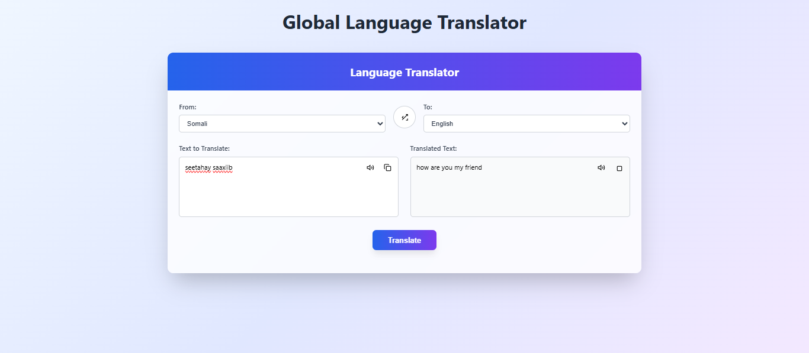

 # Js_Exercise_39
 
 ***
 
 ## Developer Name : Eng Abdirahman Ai
 
 ***
 
 ## Group A
 
 ***
 [github Link](https://github.com/engai2025/All-js)
 
 ***
 
 ## Code
 
 ~~~ Javascript
 
   <h2>Exercise 39 Html</h2>
 
  <!DOCTYPE html>
<html lang="en">
<head>
    <meta charset="UTF-8">
    <meta name="viewport" content="width=device-width, initial-scale=1.0">
    <title>Global Language Translator</title>
    
</head>
<body>
    

        

            <h1>Global Language Translator</h1>
            <!-- 
Translate text between 100+ languages instantly
 -->
        

        

            

                <h2>Language Translator</h2>
            

            

                <!-- Language Selection -->
                

                    

                        <label for="from-lang">From:</label>
                        <select id="from-lang">
                            <!-- Languages will be populated by JavaScript -->
                        </select>
                    

                    <button class="swap-btn" onclick="swapLanguages()" title="Swap languages">
                        <svg width="16" height="16" viewBox="0 0 24 24" fill="none" stroke="currentColor" stroke-width="2">
                            <path d="M16 3h5v5M4 20L21 3M21 16v5h-5M8 8l-4 4 4 4"/>
                        </svg>
                    </button>

                    

                        <label for="to-lang">To:</label>
                        <select id="to-lang">
                            <!-- Languages will be populated by JavaScript -->
                        </select>
                    

                

                <!-- Text Input and Output -->
                

                    

                        <label for="input-text">Text to Translate:</label>
                        

                            <textarea id="input-text" placeholder="Enter text to translate..."></textarea>
                            

                                <button class="action-btn" onclick="speakText('input')" title="Speak text">
                                    <svg width="16" height="16" viewBox="0 0 24 24" fill="none" stroke="currentColor" stroke-width="2">
                                        <polygon points="11 5 6 9 2 9 2 15 6 15 11 19 11 5"/>
                                        <path d="M15.54 8.46a5 5 0 0 1 0 7.07M19.07 4.93a10 10 0 0 1 0 14.14"/>
                                    </svg>
                                </button>
                                <button class="action-btn" onclick="copyText('input')" title="Copy text">
                                    <svg width="16" height="16" viewBox="0 0 24 24" fill="none" stroke="currentColor" stroke-width="2">
                                        <rect width="14" height="14" x="8" y="8" rx="2" ry="2"/>
                                        <path d="M4 16c-1.1 0-2-.9-2-2V4c0-1.1.9-2 2-2h10c1.1 0 2 .9 2 2"/>
                                    </svg>
                                </button>
                            

                        

                    

                    

                        <label>Translated Text:</label>
                        

                            <textarea id="output-text" class="textarea-readonly" placeholder="Translation will appear here..." readonly></textarea>
                            

                                <button class="action-btn green" onclick="speakText('output')" title="Speak translation">
                                    <svg width="16" height="16" viewBox="0 0 24 24" fill="none" stroke="currentColor" stroke-width="2">
                                        <polygon points="11 5 6 9 2 9 2 15 6 15 11 19 11 5"/>
                                        <path d="M15.54 8.46a5 5 0 0 1 0 7.07M19.07 4.93a10 10 0 0 1 0 14.14"/>
                                    </svg>
                                </button>
                                <button class="action-btn green" onclick="copyText('output')" title="Copy translation">
                                    <svg width="16" height="16" viewBox="0 0 24 24" fill="none" stroke="currentColor" stroke-width="2">
                                        <rect width="14" height="14" x="8" y="8" rx="2" ry="2"/>
                                        <path d="M4 16c-1.1 0-2-.9-2V4c0-1.1.9-2 2-2h10c1.1 0 2 .9 2 2"/>
                                    </svg>
                                </button>
                            

                        

                    

                

                <!-- Translate Button -->
                

                    <button class="translate-btn" onclick="translateText()" id="translate-btn">
                        Translate
                    </button>
                

                <!-- Footer -->
                

                    <!-- 
Powered by MyMemory Translation API • Free translation service
 -->
                

            

        

    

    <!-- Toast notification -->
    

    
</body>
</html>

   <h2>Exercise 39 Css</h2>

   /* General Styles */
 body {
    font-family: 'Segoe UI', Tahoma, Geneva, Verdana, sans-serif;
    background-color: #e0f7fa; /* Light blue background */
    display: flex;
    justify-content: center;
    align-items: flex-start; /* Align to top */
    min-height: 100vh;
    margin: 0;
    padding: 30px 20px;
    box-sizing: border-box;
}

.container {
    background-color: #ffffff;
    padding: 40px;
    border-radius: 12px;
    box-shadow: 0 8px 20px rgba(0, 0, 0, 0.15);
    width: 100%;
    max-width: 600px;
    text-align: center;
    border: 1px solid #cce7e4;
}

h1 {
    color: #00796b; /* Dark cyan */
    margin-bottom: 30px;
    font-size: 2.2em;
    font-weight: 600;
}

.form-group {
    margin-bottom: 25px;
    text-align: left;
}

label {
    display: block;
    margin-bottom: 10px;
    font-weight: bold;
    color: #333;
    font-size: 1.1em;
}

select,
textarea {
    width: 100%;
    padding: 12px 15px;
    border: 1px solid #b2dfdb; /* Light teal border */
    border-radius: 8px;
    font-size: 1em;
    box-sizing: border-box;
    transition: border-color 0.3s ease, box-shadow 0.3s ease;
}

select:focus,
textarea:focus {
    border-color: #00796b;
    box-shadow: 0 0 0 3px rgba(0, 121, 107, 0.2);
    outline: none;
}

textarea {
    resize: vertical;
    min-height: 120px;
    max-height: 300px;
}

button {
    background-color: #00796b; /* Dark cyan */
    color: white;
    padding: 15px 30px;
    border: none;
    border-radius: 8px;
    cursor: pointer;
    font-size: 1.1em;
    font-weight: bold;
    transition: background-color 0.3s ease, transform 0.2s ease;
    width: 100%;
    margin-top: 15px;
    box-shadow: 0 4px 10px rgba(0, 121, 107, 0.2);
}

button:hover {
    background-color: #004d40; /* Darker cyan */
    transform: translateY(-2px);
}

button:active {
    transform: translateY(0);
    box-shadow: 0 2px 5px rgba(0, 121, 107, 0.3);
}

.translated-section {
    margin-top: 35px;
    padding-top: 25px;
    border-top: 1px dashed #b2dfdb; /* Dashed light teal border */
    text-align: left;
}

.translated-section h3 {
    color: #00796b;
    margin-bottom: 15px;
    font-size: 1.5em;
}

.translated-section p {
    background-color: #e0f2f7; /* Lighter blue */
    padding: 20px;
    border-radius: 8px;
    font-size: 1.1em;
    color: #263238; /* Darker text for readability */
    min-height: 80px; /* Ensure space for translation */
    word-wrap: break-word; /* Prevents long words from overflowing */
    line-height: 1.6;
    border: 1px solid #b3e5fc; /* Light blue border */
}

   <h2>Exercise 39 JavaScript</h2>
 
//Exercise 39
  document.addEventListener('DOMContentLoaded', () => {
    const fromLanguageSelect = document.getElementById('fromLanguage');
    const toLanguageSelect = document.getElementById('toLanguage');
    const textToTranslateInput = document.getElementById('textToTranslate');
    const translateBtn = document.getElementById('translateBtn');
    const translatedTextOutput = document.getElementById('translatedText');

    // RapidAPI key iyo host
    // MUHIIM: Furihii API-ga waa mid furan. Ha u isticmaalin codsi rasmi ah!
    const RAPIDAPI_KEY = '1dfe0cf2afmsh8dd581ff6cbb2e2p1f22dejsn557b3c87ddcd';
    const RAPIDAPI_HOST = 'microsoft-translator-text-api3.p.rapidapi.com';

    // Funtion-kan wuxuu soo shubayaa luqadaha la heli karo isagoo isticmaalaya "Get Languages" API
    // Tan waxay ku dhex jiri doontaa function async ah si loo waco fetch.
    async function fetchAndPopulateLanguages() {
        const languagesUrl = `https://${RAPIDAPI_HOST}/languages`;
        const languagesOptions = {
            method: 'GET',
            headers: {
                'x-rapidapi-key': RAPIDAPI_KEY,
                'x-rapidapi-host': RAPIDAPI_HOST
            }
        };

        try {
            const response = await fetch(languagesUrl, languagesOptions);
            if (!response.ok) {
                let errorDetails = await response.text();
                try {
                    const errorJson = JSON.parse(errorDetails);
                    errorDetails = errorJson.message || JSON.stringify(errorJson);
                } catch (e) {
                    // It's plain text, not JSON
                }
                throw new Error(`Failed to fetch languages: ${response.status} - ${errorDetails}`);
            }
            const result = await response.json();

            const languages = Object.entries(result.translation).map(([code, details]) => ({
                code: code,
                name: details.name
            })).sort((a, b) => a.name.localeCompare(b.name));

            fromLanguageSelect.innerHTML = '';
            toLanguageSelect.innerHTML = '';

            languages.forEach(lang => {
                const optionFrom = document.createElement('option');
                optionFrom.value = lang.code;
                optionFrom.textContent = lang.name;
                fromLanguageSelect.appendChild(optionFrom);

                const optionTo = document.createElement('option');
                optionTo.value = lang.code;
                optionTo.textContent = lang.name;
                toLanguageSelect.appendChild(optionTo);
            });

            fromLanguageSelect.value = 'en'; // Default to English
            toLanguageSelect.value = 'so';   // Default to Somali
            if (!toLanguageSelect.value) { // Fallback if Somali is not found
                toLanguageSelect.selectedIndex = 0;
            }

        } catch (error) {
            console.error('Error fetching languages:', error);
            fromLanguageSelect.innerHTML = '<option value="">Error loading languages</option>';
            toLanguageSelect.innerHTML = '<option value="">Error loading languages</option>';
            translatedTextOutput.textContent = 'Could not load languages. Please check your API key, internet connection, or RapidAPI quota.';
            alert('Waxa dhacday cilad markii la soo shubayay luqadaha. Fadlan hubi API Key-gaaga ama isku xirkaaga internetka.');
        }
    }

    // Call the function to load languages when the page loads
    fetchAndPopulateLanguages();

    // Event listener for the Translate button
    translateBtn.addEventListener('click', async () => {
        const fromLang = fromLanguageSelect.value;
        const toLang = toLanguageSelect.value;
        const text = textToTranslateInput.value.trim();

        if (text === '') {
            translatedTextOutput.textContent = 'Fadlan geli qoraal aad rabto inaad tarjumto.';
            return;
        }
        if (!fromLang || !toLang) {
            translatedTextOutput.textContent = 'Fadlan dooro labada luqadood ee aad rabto inaad u kala tarjumto.';
            return;
        }

        translatedTextOutput.textContent = 'Tarjumaya...'; // Display a loading message

        // Using the "Large Text Translation" API endpoint
        const translateUrl = `https://${RAPIDAPI_HOST}/largetranslate?to=${toLang}&from=${fromLang}`;
        const translateOptions = {
            method: 'POST',
            headers: {
                'x-rapidapi-key': RAPIDAPI_KEY,
                'x-rapidapi-host': RAPIDAPI_HOST,
                'Content-Type': 'application/json'
            },
            body: JSON.stringify({
                sep: '|', // Required by the API, even for single text.
                text: text // The text to be translated
            })
        };

        try {
            const response = await fetch(translateUrl, translateOptions);

            if (!response.ok) {
                let errorDetails = await response.text();
                try {
                    const errorJson = JSON.parse(errorDetails);
                    errorDetails = errorJson.message || JSON.stringify(errorJson);
                } catch (e) {
                    // It's plain text, not JSON
                }
                throw new Error(`Translation API Error: ${response.status} - ${errorDetails}`);
            }

            const translatedResult = await response.text(); // The result is plain text
            translatedTextOutput.textContent = translatedResult;

        } catch (error) {
            console.error('Error during translation:', error);
            translatedTextOutput.textContent = `Waxa dhacday cilad: ${error.message}. Fadlan isku day mar kale.`;
            alert(`Waxa dhacday cilad: ${error.message}. Hubi consol-ka wixii faahfaahin ah.`);
        }
    });
});
 ~~~
 
 
  
 
 ## Output
 
 ***
 ## Home
 

 
 
 
 
 
 
 ***
 
  
 
 ## Programming language used
 
 ***
 
 |Programming Language |Framworke | Database
 |:-------------------|:----------|:--------
 |Html                |0          |0
 |Css                  |0          |0
 |JavaScript          |0          |0
 
 ***
 
 ## Task
 
 - [x] Done
 