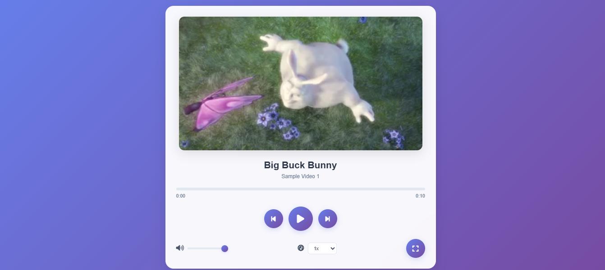
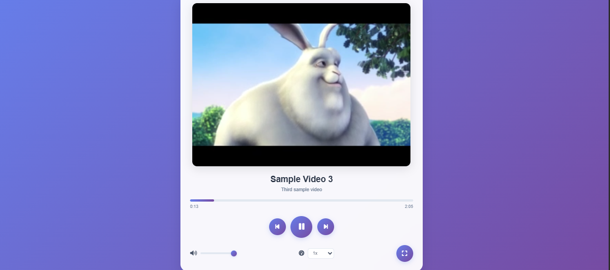

 # Js_Exercise_40
 
 ***
 
 ## Developer Name : Eng Abdirahman Ai
 
 ***
 
 ## Group A
 
 ***
 [github Link](https://github.com/engai2025/All-js)
 
 ***
 
 ## Code
 
 ~~~ Javascript
 
   <h2>Exercise 40 Html</h2>
 
  <!DOCTYPE html>
<html lang="en">
<head>
    <meta charset="UTF-8">
    <meta name="viewport" content="width=device-width, initial-scale=1.0">
    <title>Modern Video Player</title>
    <link rel="stylesheet" href="style.css">
    <link rel="stylesheet" href="https://cdnjs.cloudflare.com/ajax/libs/font-awesome/6.4.0/css/all.min.css">
</head>
<body>
    

        

            <video id="video" class="video-element">
                <source src="https://www.w3schools.com/html/mov_bbb.mp4" type="video/mp4">
                Your browser does not support the video tag.
            </video>
            
            

                <h2 id="video-title">Sample Video</h2>
                
Big Buck Bunny - Sample Video

            

            
            

                

                    

                

                

                    0:00
                    0:00
                

            

            
            

                <button id="prev-btn" class="control-btn">
                    <i class="fas fa-step-backward"></i>
                </button>
                <button id="play-btn" class="control-btn play-btn">
                    <i class="fas fa-play"></i>
                </button>
                <button id="next-btn" class="control-btn">
                    <i class="fas fa-step-forward"></i>
                </button>
            

            
            

                

                    <i class="fas fa-volume-up" id="volume-icon"></i>
                    <input type="range" id="volume-slider" min="0" max="1" step="0.1" value="1">
                

                

                    <i class="fas fa-tachometer-alt"></i>
                    <select id="speed-select">
                        <option value="0.5">0.5x</option>
                        <option value="0.75">0.75x</option>
                        <option value="1" selected>1x</option>
                        <option value="1.25">1.25x</option>
                        <option value="1.5">1.5x</option>
                        <option value="2">2x</option>
                    </select>
                

                <button id="fullscreen-btn" class="control-btn">
                    <i class="fas fa-expand"></i>
                </button>
            

        

    

    
    
</body>
</html>

   <h2>Exercise 40 Css</h2>

   /* General Styles */
  * {
    margin: 0;
    padding: 0;
    box-sizing: border-box;
}

body {
    font-family: 'Arial', sans-serif;
    background: linear-gradient(135deg, #667eea 0%, #764ba2 100%);
    min-height: 100vh;
    display: flex;
    justify-content: center;
    align-items: center;
    padding: 20px;
}

.video-player-container {
    background: rgba(255, 255, 255, 0.95);
    backdrop-filter: blur(20px);
    border-radius: 24px;
    box-shadow: 0 20px 40px rgba(0, 0, 0, 0.1);
    padding: 32px;
    max-width: 800px;
    width: 100%;
}

.video-wrapper {
    text-align: center;
}

.video-element {
    width: 100%;
    max-width: 720px;
    height: auto;
    border-radius: 16px;
    box-shadow: 0 8px 32px rgba(0, 0, 0, 0.12);
    margin-bottom: 24px;
}

.video-info {
    margin-bottom: 24px;
}

.video-info h2 {
    font-size: 28px;
    font-weight: 700;
    color: #2d3748;
    margin-bottom: 8px;
}

.video-info p {
    font-size: 16px;
    color: #718096;
}

.progress-container {
    margin-bottom: 24px;
}

.progress-bar {
    background: #e2e8f0;
    border-radius: 8px;
    height: 8px;
    width: 100%;
    overflow: hidden;
    cursor: pointer;
    transition: height 0.2s ease;
}

.progress-bar:hover {
    height: 12px;
}

.progress {
    background: linear-gradient(90deg, #667eea, #764ba2);
    width: 0%;
    height: 100%;
    transition: width 0.1s linear;
    border-radius: 8px;
}

.time-display {
    display: flex;
    justify-content: space-between;
    font-size: 14px;
    color: #718096;
    margin-top: 8px;
    font-weight: 500;
}

.controls {
    display: flex;
    justify-content: center;
    align-items: center;
    gap: 16px;
    margin-bottom: 24px;
}

.control-btn {
    background: linear-gradient(135deg, #667eea, #764ba2);
    border: none;
    color: white;
    width: 56px;
    height: 56px;
    border-radius: 50%;
    cursor: pointer;
    font-size: 20px;
    display: flex;
    align-items: center;
    justify-content: center;
    transition: all 0.3s ease;
    box-shadow: 0 4px 16px rgba(102, 126, 234, 0.3);
}

.control-btn:hover {
    transform: translateY(-2px);
    box-shadow: 0 8px 24px rgba(102, 126, 234, 0.4);
}

.control-btn:active {
    transform: translateY(0);
}

.play-btn {
    width: 72px;
    height: 72px;
    font-size: 28px;
}

.additional-controls {
    display: flex;
    justify-content: space-between;
    align-items: center;
    flex-wrap: wrap;
    gap: 16px;
}

.volume-container,
.speed-container {
    display: flex;
    align-items: center;
    gap: 12px;
}

.volume-container i,
.speed-container i {
    color: #4a5568;
    font-size: 18px;
}

#volume-slider {
    -webkit-appearance: none;
    appearance: none;
    width: 120px;
    height: 6px;
    background: #e2e8f0;
    outline: none;
    border-radius: 6px;
    cursor: pointer;
}

#volume-slider::-webkit-slider-thumb {
    -webkit-appearance: none;
    appearance: none;
    width: 20px;
    height: 20px;
    background: linear-gradient(135deg, #667eea, #764ba2);
    cursor: pointer;
    border-radius: 50%;
    box-shadow: 0 2px 8px rgba(102, 126, 234, 0.3);
}

#volume-slider::-moz-range-thumb {
    width: 20px;
    height: 20px;
    background: linear-gradient(135deg, #667eea, #764ba2);
    cursor: pointer;
    border-radius: 50%;
    border: none;
    box-shadow: 0 2px 8px rgba(102, 126, 234, 0.3);
}

#speed-select {
    padding: 8px 12px;
    border-radius: 8px;
    border: 2px solid #e2e8f0;
    background-color: white;
    color: #4a5568;
    font-size: 14px;
    font-weight: 500;
    cursor: pointer;
    transition: border-color 0.3s ease;
}

#speed-select:focus {
    outline: none;
    border-color: #667eea;
}

@media (max-width: 640px) {
    .video-player-container {
        padding: 20px;
    }
    
    .additional-controls {
        flex-direction: column;
        align-items: stretch;
    }
    
    .volume-container,
    .speed-container {
        justify-content: center;
    }
    
    .controls {
        gap: 12px;
    }
    
    .control-btn {
        width: 48px;
        height: 48px;
        font-size: 16px;
    }
    
    .play-btn {
        width: 64px;
        height: 64px;
        font-size: 24px;
    }
}

   <h2>Exercise 40 JavaScript</h2>
 
//Exercise 40
 // Video player variables
const video = document.getElementById('video');
const playBtn = document.getElementById('play-btn');
const prevBtn = document.getElementById('prev-btn');
const nextBtn = document.getElementById('next-btn');
const progressBar = document.querySelector('.progress-bar');
const progress = document.getElementById('progress');
const currentTimeEl = document.getElementById('current-time');
const durationEl = document.getElementById('duration');
const volumeSlider = document.getElementById('volume-slider');
const speedSelect = document.getElementById('speed-select');
const fullscreenBtn = document.getElementById('fullscreen-btn');
const volumeIcon = document.getElementById('volume-icon');
const videoTitle = document.getElementById('video-title');
const videoDescription = document.getElementById('video-description');

// Video playlist
const videos = [
    {
        title: 'Big Buck Bunny',
        description: 'Sample Video 1',
        src: 'https://www.w3schools.com/html/mov_bbb.mp4'
    },
    {
        title: 'Sample Video 2',
        description: 'Another sample video',
        src: 'https://sample-videos.com/zip/10/mp4/SampleVideo_1280x720_1mb.mp4'
    },
    {
        title: 'Sample Video 3',
        description: 'Third sample video',
        src: 'https://www.learningcontainer.com/wp-content/uploads/2020/05/sample-mp4-file.mp4'
    }
];

let currentVideoIndex = 0;
let isPlaying = false;

// Load video
function loadVideo(index) {
    if (videos[index]) {
        video.src = videos[index].src;
        videoTitle.textContent = videos[index].title;
        videoDescription.textContent = videos[index].description;
    }
}

// Play video
function playVideo() {
    video.play();
    isPlaying = true;
    playBtn.querySelector('i').classList.remove('fa-play');
    playBtn.querySelector('i').classList.add('fa-pause');
}

// Pause video
function pauseVideo() {
    video.pause();
    isPlaying = false;
    playBtn.querySelector('i').classList.remove('fa-pause');
    playBtn.querySelector('i').classList.add('fa-play');
}

// Toggle play/pause
function togglePlay() {
    if (isPlaying) {
        pauseVideo();
    } else {
        playVideo();
    }
}

// Previous video
function previousVideo() {
    currentVideoIndex = currentVideoIndex > 0 ? currentVideoIndex - 1 : videos.length - 1;
    loadVideo(currentVideoIndex);
    if (isPlaying) {
        playVideo();
    }
}

// Next video
function nextVideo() {
    currentVideoIndex = currentVideoIndex < videos.length - 1 ? currentVideoIndex + 1 : 0;
    loadVideo(currentVideoIndex);
    if (isPlaying) {
        playVideo();
    }
}

// Update progress
function updateProgress() {
    const { duration, currentTime } = video;
    
    if (duration) {
        const progressPercent = (currentTime / duration) * 100;
        progress.style.width = `${progressPercent}%`;
        
        // Update time display
        currentTimeEl.textContent = formatTime(currentTime);
        durationEl.textContent = formatTime(duration);
    }
}

// Set progress
function setProgress(e) {
    const width = progressBar.clientWidth;
    const clickX = e.offsetX;
    const duration = video.duration;
    
    if (duration) {
        video.currentTime = (clickX / width) * duration;
    }
}

// Format time helper
function formatTime(time) {
    const minutes = Math.floor(time / 60);
    const seconds = Math.floor(time % 60);
    return `${minutes}:${seconds.toString().padStart(2, '0')}`;
}

// Update volume icon
function updateVolumeIcon() {
    const volume = video.volume;
    const icon = volumeIcon;
    
    icon.classList.remove('fa-volume-up', 'fa-volume-down', 'fa-volume-mute');
    
    if (volume === 0) {
        icon.classList.add('fa-volume-mute');
    } else if (volume < 0.5) {
        icon.classList.add('fa-volume-down');
    } else {
        icon.classList.add('fa-volume-up');
    }
}

// Toggle fullscreen
function toggleFullscreen() {
    if (!document.fullscreenElement) {
        video.requestFullscreen().catch(err => {
            console.log(`Error attempting to enable fullscreen: ${err.message}`);
        });
        fullscreenBtn.querySelector('i').classList.remove('fa-expand');
        fullscreenBtn.querySelector('i').classList.add('fa-compress');
    } else {
        document.exitFullscreen();
        fullscreenBtn.querySelector('i').classList.remove('fa-compress');
        fullscreenBtn.querySelector('i').classList.add('fa-expand');
    }
}

// Event listeners
playBtn.addEventListener('click', togglePlay);
prevBtn.addEventListener('click', previousVideo);
nextBtn.addEventListener('click', nextVideo);
video.addEventListener('timeupdate', updateProgress);
video.addEventListener('loadedmetadata', updateProgress);
progressBar.addEventListener('click', setProgress);
fullscreenBtn.addEventListener('click', toggleFullscreen);

// Volume control
volumeSlider.addEventListener('input', (e) => {
    video.volume = e.target.value;
    updateVolumeIcon();
});

// Speed control
speedSelect.addEventListener('change', (e) => {
    video.playbackRate = parseFloat(e.target.value);
});

// Video ended event
video.addEventListener('ended', () => {
    pauseVideo();
    nextVideo();
});

// Keyboard controls
document.addEventListener('keydown', (e) => {
    switch(e.code) {
        case 'Space':
            e.preventDefault();
            togglePlay();
            break;
        case 'ArrowLeft':
            video.currentTime -= 10;
            break;
        case 'ArrowRight':
            video.currentTime += 10;
            break;
        case 'ArrowUp':
            e.preventDefault();
            video.volume = Math.min(video.volume + 0.1, 1);
            volumeSlider.value = video.volume;
            updateVolumeIcon();
            break;
        case 'ArrowDown':
            e.preventDefault();
            video.volume = Math.max(video.volume - 0.1, 0);
            volumeSlider.value = video.volume;
            updateVolumeIcon();
            break;
        case 'KeyF':
            toggleFullscreen();
            break;
    }
});

// Fullscreen change event
document.addEventListener('fullscreenchange', () => {
    if (!document.fullscreenElement) {
        fullscreenBtn.querySelector('i').classList.remove('fa-compress');
        fullscreenBtn.querySelector('i').classList.add('fa-expand');
    }
});

// Initialize
loadVideo(currentVideoIndex);
updateVolumeIcon();

// Click to play/pause video
video.addEventListener('click', togglePlay);

console.log('Video player initialized successfully!');

 ~~~
 
 
  
 
 ## Output
 
 ***
 ## Home
 

  

 
 
 
 
 
 
 ***
 
  
 
 ## Programming language used
 
 ***
 
 |Programming Language |Framworke | Database
 |:-------------------|:----------|:--------
 |Html                |0          |0
 |Css                  |0          |0
 |JavaScript          |0          |0
 
 ***
 
 ## Task
 
 - [x] Done
 